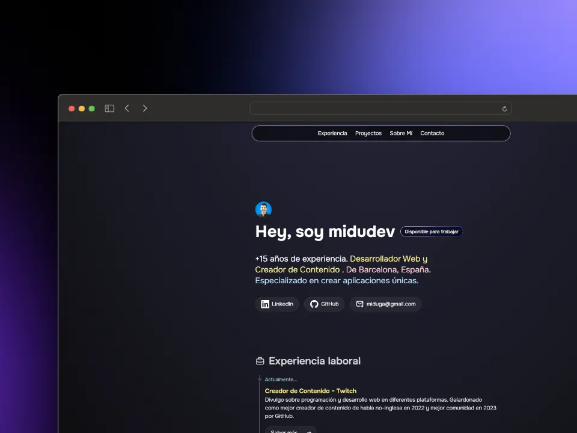

# 👨🏻‍💻 Porfolio para programadores y desarrolladores

## 🫂 Contribuidores

## Updating Portfolio Content

The content of this portfolio (About Me, Experience, Projects) is managed through a central JSON file located at `src/data/content.json`.

To update your portfolio information:

1.  **Open `src/data/content.json`**.
2.  **Modify the data**:
    *   **`aboutMe`**:
        *   `personalImageAlt`: Alt text for your main image.
        *   `paragraphs`: An array of strings. Each string is a paragraph in the "About Me" section. You can use HTML tags like `<strong>` or `<em>` for emphasis.
    *   **`experience`**: An array of experience objects. Each object has:
        *   `date`: Date or period of the experience.
        *   `title`: Your job title.
        *   `company`: Company name.
        *   `description`: Description of your role and achievements.
        *   `link` (optional): A URL for more details.
    *   **`projects`**:
        *   `tags`: An object defining available tags for projects. Each key (e.g., "NEXT") is a tag identifier used in `project.items`. It contains:
            *   `name`: Display name of the tag (e.g., "Next.js").
            *   `class`: Tailwind CSS classes for styling the tag badge.
            *   `icon`: A string key (e.g., "NextJS") that maps to an icon component in `src/components/Projects.astro`. Ensure the corresponding icon component (e.g., `NextJS.astro`) exists in `src/components/icons/` and is mapped in the `ICONS` object within `src/components/Projects.astro`.
        *   `items`: An array of project objects. Each object has:
            *   `title`: Project title.
            *   `description`: Project description.
            *   `link` (optional): Live preview URL.
            *   `github` (optional): GitHub repository URL.
            *   `image`: Path to the project image (usually in `public/projects/`).
            *   `tags`: An array of string keys (e.g., `["NEXT", "TAILWIND"]`) that correspond to keys in `projects.tags`.
3.  **Save the file**. The website will automatically reflect the changes when you rebuild or if your development server is running with HMR (Hot Module Replacement).

Make sure the JSON structure remains valid after your changes.
